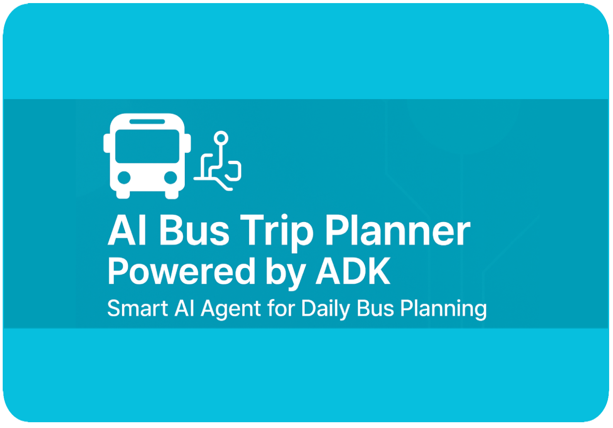
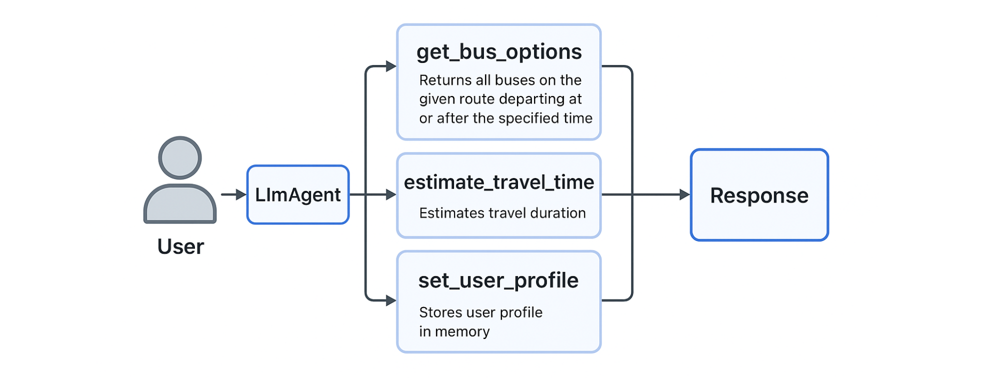
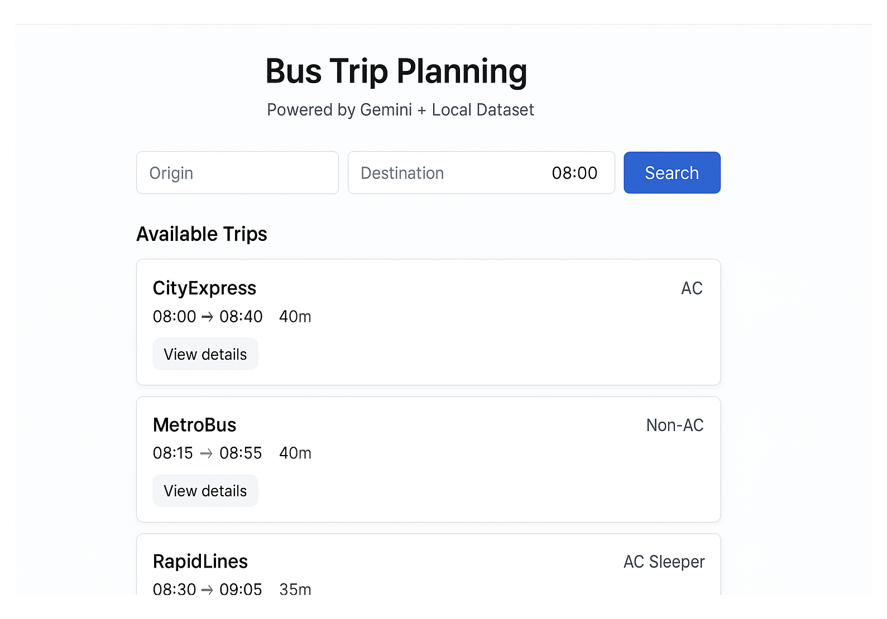
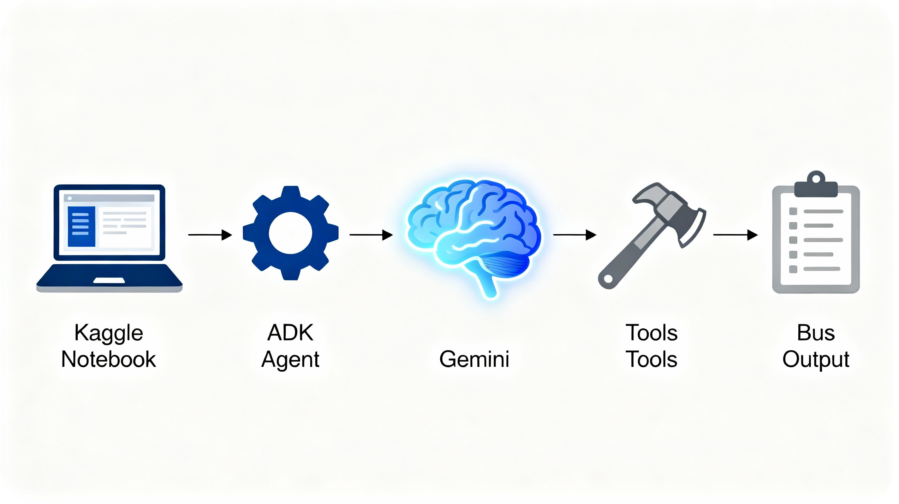

<h1 align="center">
AI Bus Trip Planner – ADK Capstone Project
</h1>


This project demonstrates an AI-powered bus trip planner agent, created for the Kaggle Capstone Project using the Agent Development Kit (ADK). The agent helps users plan bus journeys from home to college (and back), with features like interactive memory, custom trip scheduling, and dynamic tool invocation.

<p align="center">
  
</p>

AI Bus Trip Planner (ADK Agent)
 
**Key capabilities:**
- Remembers your home, college, and preferred departure time (via memory tool).
- Recommends the best bus based on your request and the latest timetable.
- Allows both direct and natural language queries.
 
---


*Example Conversations*

```
Set user profile (memory)
response = await bus_runner.run_debug(
    "My home is Home, my college is College, and I usually leave at 08:30."
)
print(response[-1])

Plan a trip using your saved preferences
response = await bus_runner.run_debug(
    "Plan my usual morning trip."
)
print(response[-1])
```
Architecture

<p align="center">
  
</p>

The agent will reply with a bus recommendation using its internal tools and memory.

---

***Problem Statement:***
---

**Current public transport information systems are often predominantly search-based rather than personalized assistants. Users must repeatedly input origin, destination, and time for every query, even for routine trips. This lack of state persistence (memory) and contextual awareness creates friction.
The challenge is to build an AI agent that can:**

*Abstract away static data: Interface with a fixed timetable using natural language instead of manual lookups.*

*Retain context: Remember user-specific attributes (Home stop, College stop, preferred time) to enable shorthand queries like "Plan my usual trip."*

*Reason about time: Dynamically filter future bus options based on a "departure after" constraint rather than just showing a full list.*

---

<p align="center">
  
</p>

***Implementation***
---

*This project uses Google’s Agent Development Kit (ADK) with a Gemini model to build a function-calling agent that can read a small in-notebook bus timetable and call custom Python tools. Four core tools are implemented: one to fetch bus options, one to estimate travel time, and two to store and retrieve the user profile (home, college, default departure time). An LlmAgent is configured with instructions to use these tools, and an InMemoryRunner manages the conversation flow so that natural language prompts are transformed into tool calls and final responses.*


***Why this project***
---

*Many students and commuters rely on fixed bus routes between home and college but do not have an easy way to check the best option for a specific time each day. Timetables are often static, hard to read, and require manual scanning, which is slow and error-prone during busy mornings. An AI agent that understands natural language and remembers personal preferences can make this daily planning faster, more accurate, and more accessible for all age groups.*

<p align="center">
  
</p>

***Benefits***

Personalized experience: The agent remembers the user’s home, college, and preferred departure time, so repeated queries become shorter and more natural.

Faster decisions: Instead of scanning tables, users simply ask questions like “Plan my usual morning trip,” and immediately see the recommended bus.

Extensible design: The same architecture can scale to real-time bus APIs or city-wide routes, making it suitable as a starting point for a production transit assistant.


***Conclusion***
---

*The AI Bus Trip Planner demonstrates how an agent with memory and function tools can solve a focused, real‑world problem: daily bus trip planning between fixed locations. By remembering a user’s usual home and college stops, along with their preferred departure time, the agent reduces repetitive input and makes the experience feel more like talking to a personal assistant than working with a traditional timetable.*

*Although the current prototype relies on a small, static schedule and simple rule-based logic, its architecture is deliberately designed to be extensible. The same pattern of tools and state can be connected to live transit APIs, GPS feeds, and richer user profiles to support dynamic routes, real-time delays, and multiple cities or institutions.*
 
*This project therefore serves as a compact but complete example of how conversational agents can wrap complex transport data in a friendly interface. With further development such as error handling, multilingual support, and integration into mobile or kiosk interfaces—the Bus Trip Planner could evolve from a classroom prototype into a practical assistant for everyday commuters.*


---
<p align="center">
  
</p>

***Future Scope***
---

This project is designed to be scalable. Future enhancements include:
Predictive AI Analytics: Implementing ML models to predict delays based on historical traffic and weather patterns rather than just real-time tracking.​
Hardware Integration: Deploying physical ESP32/Raspberry Pi modules with NEO-6M GPS on buses for live telemetry instead of simulated data.​
Smart Occupancy Detection: Using IR sensors or computer vision to provide real-time "Seat Availability" status to users before they board.​
Multi-Modal Routing: upgrading the AI agent to coordinate between buses, metros, and last-mile cabs for door-to-door connectivity.​
Voice-Activated Interface: Adding voice command support for accessibility, allowing users to query bus timings hands-free.​
Vehicle Health Monitoring: Extending the IoT network to monitor engine health and fuel efficiency for predictive maintenance.​
